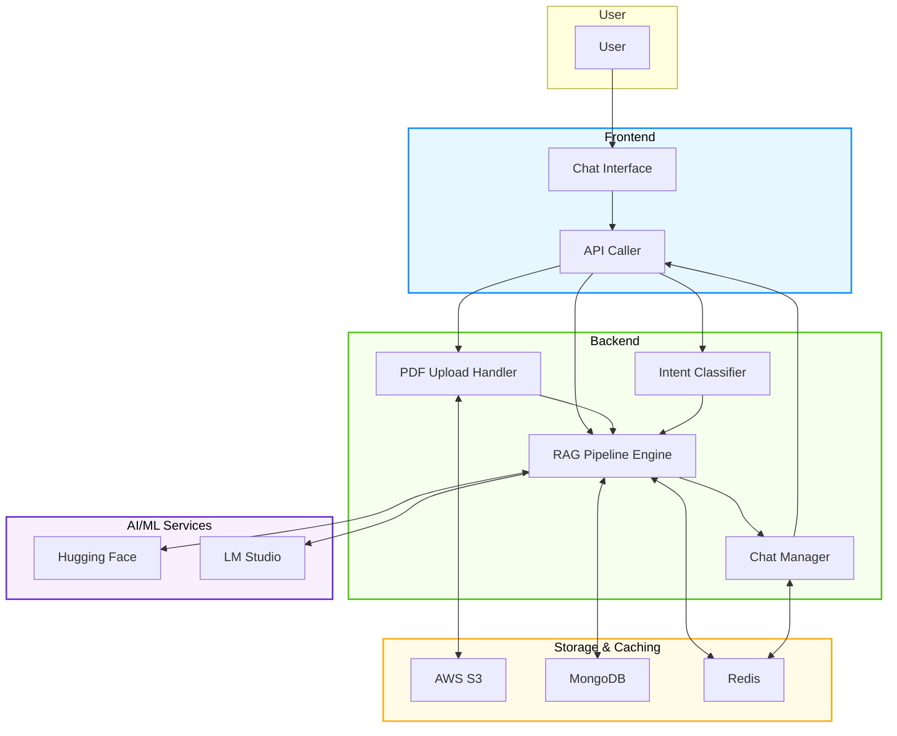

# Medical Document RAG (Retrieval-Augmented Generation) System

## Overview

Medical Document RAG (Retrieval-Augmented Generation) System is a full-stack application combining a **React frontend** and a **FastAPI backend** to deliver intelligent medical document question-answering. It leverages RAG to provide accurate, context-aware responses based on uploaded PDF documents.

## Key Features

### 🔍 Intelligent Document Processing
- PDF Upload & Processing: Automatic extraction of text, tables, and images from medical PDFs
- Multi-Modal RAG: Comprehensive understanding using text, tables, and image captions
- Vector Search: Advanced embedding models (PubMedBERT) for medical content

### 🧠 Smart Query Processing
- Intent Classification: Determines if questions require document retrieval or direct answers
- Auto Document Selection: Selects the most relevant document for each query
- Conversation Memory: Maintains chat history with context
- Streaming Responses: Real-time response streaming

### 💬 Advanced Chat System
- Persistent Chat Sessions: Redis-based storage
- Multi-Session Management: Create, manage, and switch between chats
- Conversation Context: Smart context injection
- Detailed Logging: Logs user interactions, document selections, and performance

### 🏥 Medical Domain Optimization
- Medical LLM: Specialized model for medical QA
- Clinical Context Understanding: Optimized prompts for medical scenarios
- Medical Terminology Support: Enhanced processing of medical terms

## Architecture

### Diagram


### Backend (FastAPI)
```
backend/
├── main.py                    # FastAPI application entry point
├── config.py                  # CORS and app configuration
├── routes.py                  # API endpoints and route handlers
├── rag_pipeline.py            # Core RAG processing logic
├── rag_config.py              # Configuration management
├── models.py                  # Data models and schemas
├── intent_classifier.py       # Query intent classification
├── chat_models.py             # Chat session and message models
├── redis_chat_manager.py      # Redis-based chat persistence
├── chat_logger.py             # Detailed chat event logging
├── upload.py                  # PDF upload handling
├── utils.py                   # Utility functions
├── logger_config.py           # Logging configuration
├── redis_cache.py             # Redis caching utilities
└── env_validator.py           # Environment validation
```

### Frontend (React + Vite)
```
frontend/
├── src/
│   ├── App.jsx              # Main application component
│   ├── main.jsx             # React application entry point
│   ├── components/
│   │   ├── Chatbot.jsx      # Main chat interface
│   │   ├── Chatbot.css      # Chat styling
│   │   ├── ChatSidebar.jsx  # Chat session management
│   │   └── ChatSidebar.css  # Sidebar styling
│   └── services/
│       └── api.js           # API communication layer
├── index.html               # HTML template
├── package.json             # Dependencies and scripts
└── vite.config.js           # Vite configuration
```


## Technology Stack

### Backend
- FastAPI: High-performance web framework
- MongoDB: Vector database for embeddings and document storage
- Redis: Caching and chat session persistence
- AWS S3: Document and metadata storage
- LangChain: LLM orchestration and prompt management
- HuggingFace: Embedding models and NLP services
- LM Studio: Local LLM inference

### Frontend
- React 19: Modern React with latest features
- Vite: Fast build tool and development server
- Axios: HTTP client for API communication
- React Markdown: Advanced markdown rendering
- KaTeX: Mathematical notation rendering
- Lucide React: Icon library

### AI/ML
- Embedding Model: NeuML/pubmedbert-base-embeddings
- Language Model: ii-medical-8b-1706
- Intent Classifier: Facebook BART-large-mnli


## Prerequisites

### System Requirements
- Node.js (v16 or higher)
- Python (3.8 or higher)
- Redis server
- MongoDB with vector search
- AWS S3 bucket
- LM Studio (for local LLM inference)

### Environment Variables
Create a `.env` file in the backend directory:
```env
# Required
HUGGINGFACE_API_KEY=your_huggingface_api_key
MONGO_URI=mongodb://your_mongodb_connection_string
OPENAI_API_BASE=http://localhost:1234/v1
# Optional
BUCKET=pdf-storage-for-rag-1
EMBEDDING_MODEL=NeuML/pubmedbert-base-embeddings
LLM_MODEL=ii-medical-8b-1706@q4_k_m
SCORE_THRESHOLD=0.75
MAX_CHUNKS=5
LOG_LEVEL=WARNING
ALLOWED_ORIGINS=http://localhost:3000,http://localhost:5173
REDIS_URL=redis://localhost:6379
```

docker-compose up -d redis

## Installation & Setup

### 1. Clone the Repository
```bash
git clone <repository-url>
cd final
```

### 2. Backend Setup
```bash
cd backend
python -m venv venv
venv\Scripts\activate  # Windows
# source venv/bin/activate  # macOS/Linux
pip install -r requirements.txt
cp .env.example .env  # Edit .env with your values
```

### 3. Frontend Setup
```bash
cd frontend
npm install
```

### 4. Infrastructure Setup
- Redis: `docker-compose up -d redis`
- MongoDB: Set up Atlas or local, enable vector search, create indexes
- LM Studio: Download, install, load model `ii-medical-8b-1706@q4_k_m`, run on port 1234


## Running the Application

### 1. Start Backend
```bash
cd backend
uvicorn main:app --reload --host 0.0.0.0 --port 8000
```

### 2. Start Frontend
```bash
cd frontend
npm run dev
```

### 3. Access
- Frontend: http://localhost:5173
- Backend API: http://localhost:8000
- API Docs: http://localhost:8000/docs


## API Endpoints

### Core
- `POST /upload_pdf/` — Upload and process PDF
- `POST /auto_ask/` — Ask questions with auto document selection
- `POST /auto_ask_stream/` — Streaming version
- `GET /list_pdfs/` — List uploaded documents

### Chat
- `POST /chats/` — Create chat session
- `GET /chats/` — List chat sessions
- `GET /chats/{chat_id}` — Get chat with messages
- `PUT /chats/{chat_id}` — Update chat title
- `DELETE /chats/{chat_id}` — Delete chat session

### Debug & Monitoring
- `GET /health/` — Health check
- `GET /debug/available_docs/` — Debug available docs
- `GET /chats/{chat_id}/logs` — Get chat logs
- `POST /admin/cleanup-logs` — Clean up old logs


## Features in Detail

### Document Processing Pipeline
- PDF Upload: Secure, validated (max 50MB, PDF only)
- Content Extraction: Text, tables, image captions
- Embedding Generation: Vector embeddings for semantic search
- S3 Storage: Stores processed content and metadata

### Smart Query Processing
- Intent Classification: Direct answer vs. retrieval
- Document Selection: Cosine similarity
- Context Retrieval: Text chunks, tables, images
- Response Generation: Medical LLM with context

### Chat System
- Session Management: Multiple conversations
- Persistent Storage: Redis
- Context Awareness: Maintains context
- Streaming Interface: Real-time responses

### Monitoring & Logging
- Comprehensive Logging: App logs, error tracking, performance
- Chat Analytics: Logs user interactions and decisions
- Health Monitoring: Health check endpoints


## Configuration Options

### RAG Pipeline
```python
SCORE_THRESHOLD=0.75
MAX_CHUNKS=5
DOC_SELECTION_CHUNKS=30
NORMALIZATION_METHOD=sqrt
MIN_DOCUMENT_CHUNKS=2
MAX_DOCUMENTS_RETURNED=5
```

### Model
```python
EMBEDDING_MODEL=NeuML/pubmedbert-base-embeddings
LLM_MODEL=ii-medical-8b-1706@q4_k_m
LLM_TEMPERATURE=0.5
```


## Development & Testing

### Code Structure
- Modular Design: Separate modules
- Type Hints: Comprehensive annotations
- Error Handling: Robust, detailed logging
- Configuration Management: Environment-based
- Caching: Redis for performance

### Testing
```bash
# Backend
cd backend
python -m pytest
# Frontend
cd frontend
npm test
```

### Production Build
```bash
cd frontend
npm run build
# Output in dist/
```


## Troubleshooting

### Common Issues
1. Redis: Ensure running (`docker-compose up -d redis`), check URL
2. MongoDB: Verify URI, create vector indexes
3. LM Studio: Run on port 1234, load medical model
4. Frontend: Clear node_modules (`rm -rf node_modules && npm install`), check Node.js version

### Debug Mode
Set `LOG_LEVEL=DEBUG` in `.env` for detailed logs


## Contributing
1. Fork the repo
2. Create a feature branch: `git checkout -b feature-name`
3. Make changes and add tests
4. Commit: `git commit -am 'Add feature'`
5. Push: `git push origin feature-name`
6. Submit a pull request


## License & Acknowledgments

This project is licensed under the MIT License — see the LICENSE file for details.

**Acknowledgments:**
- PubMedBERT: Medical embeddings
- LangChain: LLM orchestration
- FastAPI: Backend framework
- React: Frontend framework
- Medical AI Community: Domain expertise
